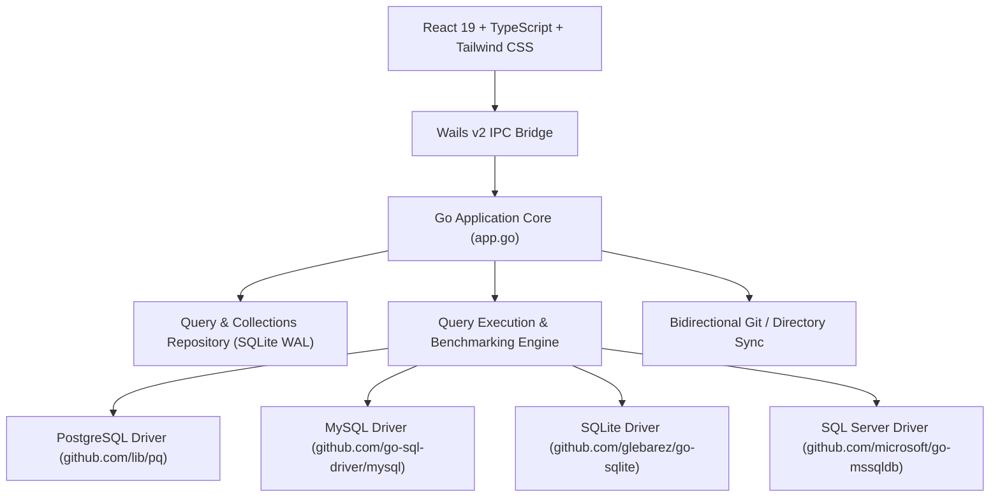

<div align="center">

# 📦 QueryBox

### Fast, Local-First SQL Query Manager & Developer Workstation

[](https://github.com/your-username/QueryBox/releases)
[](LICENSE)
[](https://golang.org)
[](https://wails.io)
[](https://react.dev)
[](https://www.typescriptlang.org)
[](https://tailwindcss.com)

<p align="center">
  <b>English</b> | <a href="#-توضیحات-به-زبان-فارسی-persian"><b>فارسی</b></a>
</p>

<p align="center">
  A modern, privacy-focused desktop SQL query library and database workbench.<br />
  Organize, edit, benchmark, and execute queries across <b>PostgreSQL</b>, <b>MySQL</b>, <b>SQLite</b>, and <b>SQL Server</b> with zero cloud dependencies.
</p>

</div>

---

## 🌟 Highlights

- 🔒 **100% Local-First & Private**: Zero telemetry, no cloud accounts, and no tracking. All queries, version histories, and connections are stored safely on your machine in an encrypted SQLite database.
- ⚡ **Pure-Go Database Drivers**: Native connectivity with **zero CGo dependencies** for **PostgreSQL**, **MySQL**, **SQLite**, and **SQL Server (T-SQL)**.
- 📐 **Database Schema Explorer & DDL Generator**: Introspect live tables, views, columns, and data types, and generate dialect-specific `CREATE TABLE` DDL with one click.
- 📊 **Interactive Data Grid & Column Profiler**: Fast virtualized grid with in-memory filtering, column sorting, visibility toggles, CSV/JSON/TSV exports, and deep statistical profiling (null counts, uniqueness, mini frequency histograms, and numeric aggregates).
- 📈 **Instant SVG Visualizer**: Convert query results into responsive Bar, Line, or Donut charts with zero heavy external charting libraries.
- 🧠 **Monaco Editor with Intelligent IntelliSense**: Context-aware SQL auto-complete pulling live table and column names directly from active connections, syntax highlighting, bracket matching, and multi-dialect SQL beautification.
- 🧩 **Dynamic Parameter Substitution**: Auto-detects `:param` and `{{param}}` template variables with a live parameter bar above the editor.
- 🗂️ **Multi-Tab Workspace & Visual Diff**: Open multiple queries in tabs and visually inspect snapshot revisions side-by-side with Monaco's diff engine.
- 💻 **Export as Code**: Generate production-ready code snippets in **Go** (`database/sql`), **TypeScript** (`pg`/`mysql2`), **Python** (`psycopg2`), **Rust** (`sqlx`), and **PHP** (`PDO`).
- 🌿 **Git / Directory Synchronization**: Bidirectional sync between your local QueryBox library and any folder as `.sql` files with clean YAML frontmatter.
- ⏱️ **Query Benchmarking & EXPLAIN Analyzer**: Run multi-iteration benchmarks (calculating min, max, avg latencies) and analyze execution plans.
- ⌨️ **Command Palette & Keyboard Cheat Sheet**: Raycast-style command palette (`Ctrl + K`) and an interactive keyboard shortcut reference (`Ctrl + /`).

---

## 🖥️ Platform Support

QueryBox compiles into a single, highly-optimized native executable for:
- 🪟 **Windows**: 10, 11 (64-bit)
- 🍎 **macOS**: Apple Silicon (M1/M2/M3/M4) & Intel (Universal Binary)
- 🐧 **Linux**: Ubuntu, Debian, Fedora, Arch (via GTK3 / WebKit2GTK)

---

## 🚀 Quick Start & Installation

### 1. Pre-built Binaries (Recommended)
Download the latest pre-compiled release for your operating system from the **[Releases Page](https://github.com/your-username/QueryBox/releases)**.

### 2. Build from Source

#### Prerequisites
- [Go](https://go.dev/dl/) `1.23` or later
- [Node.js](https://nodejs.org/) `20` or later & npm
- [Wails CLI v2](https://wails.io/docs/gettingstarted/installation):
  ```bash
  go install github.com/wailsapp/wails/v2/cmd/wails@latest
  ```

#### Clone & Run Live Development
```bash
# Clone the repository
git clone https://github.com/your-username/QueryBox.git
cd QueryBox

# Start live development with hot-reload
wails dev
```

#### Build Production Binary
```bash
wails build
```
The compiled binary will be located in `build/bin/QueryBox.exe` (Windows) or `build/bin/QueryBox` (macOS / Linux).

---

## ⌨️ Keyboard Shortcuts

| Shortcut | Action | Description |
| :--- | :--- | :--- |
| **`Ctrl + Enter`** | **Run Query** | Executes the active query on the selected database connection |
| **`Ctrl + S`** | **Save Query** | Saves query title, SQL content, and metadata |
| **`Ctrl + Shift + F`** | **Format SQL** | Formats query according to active SQL dialect |
| **`Ctrl + Shift + C`** | **Copy SQL** | Copies SQL to system clipboard |
| **`Ctrl + N`** | **New Tab** | Opens a fresh query tab in the workspace |
| **`Ctrl + B`** | **Toggle Sidebar** | Collapses / expands the navigation sidebar |
| **`Ctrl + K`** / **`Ctrl + Shift + P`** | **Command Palette** | Opens the global command palette |
| **`Ctrl + ,`** | **Settings** | Opens editor and theme settings |
| **`Ctrl + /`** | **Shortcuts Cheat Sheet** | Displays the interactive keyboard shortcuts modal |

*(On macOS, replace `Ctrl` with `Cmd ⌘`)*

---

## 🏗️ Architecture & Tech Stack



- **Core Runtime**: [Wails v2](https://wails.io) (lightweight alternative to Electron using native webview)
- **Backend**: Go with pure-Go database drivers (zero CGo toolchain required)
- **Frontend**: React 19, TypeScript 5.7, Vite 7
- **UI Components & Styling**: Tailwind CSS, Radix UI (shadcn/ui), Lucide React
- **Code Editor**: Monaco Editor (`@monaco-editor/react`) with custom IntelliSense provider and SQL formatting

---

## 🚢 Publishing a New Release (GitHub Actions)

This repository includes an automated cross-platform release workflow (`.github/workflows/release.yml`). To trigger a new release:

1. Commit and push your changes to `main`.
2. Create and push a semver tag:
   ```bash
   git tag v1.0.0
   git push origin v1.0.0
   ```
3. GitHub Actions will automatically:
   - Build binaries for **Windows (amd64)**, **Linux (amd64)**, and **macOS (Universal)**.
   - Package them into `.zip` / `.tar.gz` archives.
   - Publish a new GitHub Release with download links and changelog.

---

## 🇮🇷 توضیحات به زبان فارسی (Persian)

**QueryBox** یک نرم‌افزار دسکتاپ مدرن، سبک و کاملاً آفلاین (Local-First) برای مدیریت، نوشتن، قالب‌بندی و اجرای کوئری‌های SQL است که با ترکیب قدرت **Go** و زیبایی **React** ساخته شده است.

### ویژگی‌های کلیدی:
1. **اتصال و اجرای زنده کوئری (Live Query Execution)**: اتصال مستقیم به دیتابیس‌های PostgreSQL، MySQL، SQLite و SQL Server بدون نیاز به اینترنت و بدون ارسال داده به سرورهای ابری.
2. **مرورگر ساختار دیتابیس و تولید DDL**: مشاهده جداول، ستون‌ها، نوع داده و کلیدهای اصلی همراه با تولید خودکار دستور `CREATE TABLE`.
3. **جدول داده‌های پیشرفته (Data Grid)**: جستجوی درون‌حافظه‌ای، مرتب‌سازی ستون‌ها، انتخاب ستون‌های قابل مشاهده، خروجی CSV/JSON/TSV و پروفایلر آماری ستون‌ها (محاسبه مقادیر یکتا، رکوردهای Null، پرتکرارترین داده‌ها و شاخص‌های میانگین/مجموع).
4. **رسم نمودار آنی (Instant Charting)**: تبدیل سریع داده‌های جدولی به نمودارهای میله‌ای، خطی و دونات با SVG خالص و فوق‌العاده سریع.
5. **ادیتور هوشمند Monaco با IntelliSense**: پیشنهاد خودکار نام جداول و ستون‌های دیتابیس متصل در حین تایپ کوئری همراه با فرمت‌کننده خودکار SQL.
6. **پشتیبانی از متغیرها و پارامترها**: شناسایی خودکار پارامترهای `:param` و `{{param}}` و جایگزینی لحظه‌ای مقادیر.
7. **فضای کاری چندتبی و مقایسه بصری نسخه‌ها (Monaco Diff)**: باز کردن همزمان چندین کوئری در تب‌های مجزا و مقایسه تغییرات تاریخچه با ادیتور Diff دوطرفه.
8. **خروجی کد ("Copy as...")**: تولید فوری کدهای آماده به زبان‌های Go، TypeScript، Python، Rust و PHP.
9. **همگام‌سازی با گیت و پوشه‌های محلی**: ذخیره و فراخوانی کوئری‌ها به عنوان فایل‌های `.sql` همراه با هدرهای استاندارد فرانت‌متر.
10. **بنچمارک و ارزیابی عملکرد (Benchmark & EXPLAIN)**: محاسبه میانگین، حداقل و حداکثر تأخیر کوئری‌ها در چند تکرار پیاپی.

---

## 🤝 Contributing

Contributions, issues, and feature requests are welcome! Feel free to check the [issues page](https://github.com/your-username/QueryBox/issues).

1. Fork the Project
2. Create your Feature Branch (`git checkout -b feature/AmazingFeature`)
3. Commit your Changes (`git commit -m 'Add some AmazingFeature'`)
4. Push to the Branch (`git push origin feature/AmazingFeature`)
5. Open a Pull Request

---

## 📄 License

Distributed under the **MIT License**. See [`LICENSE`](LICENSE) for more information.
